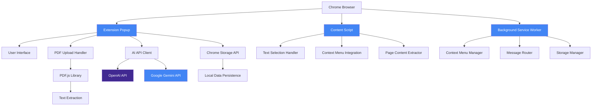
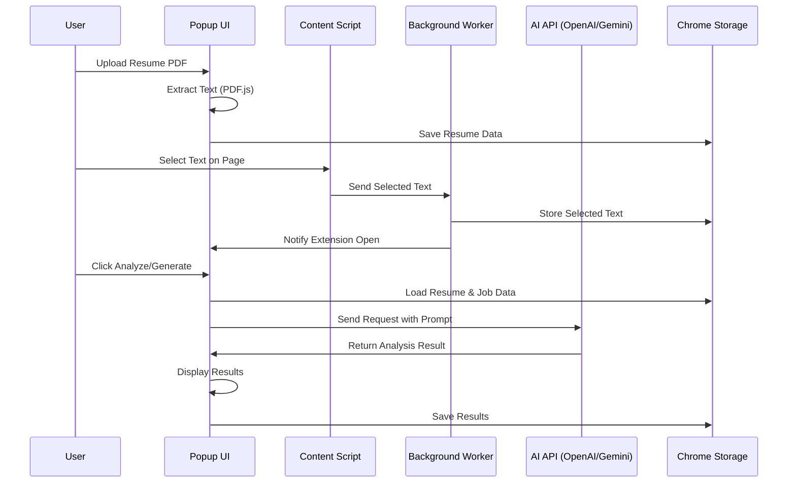
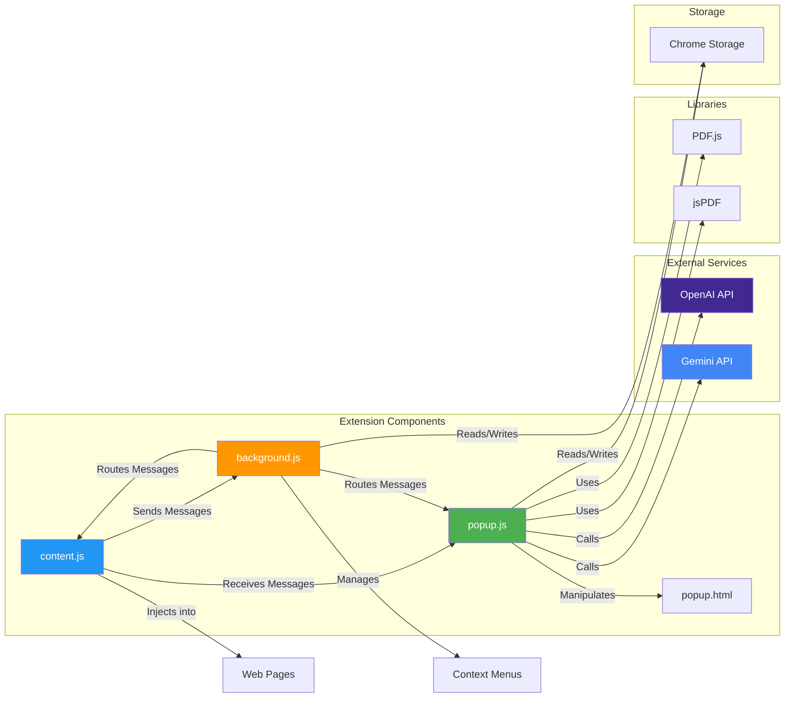
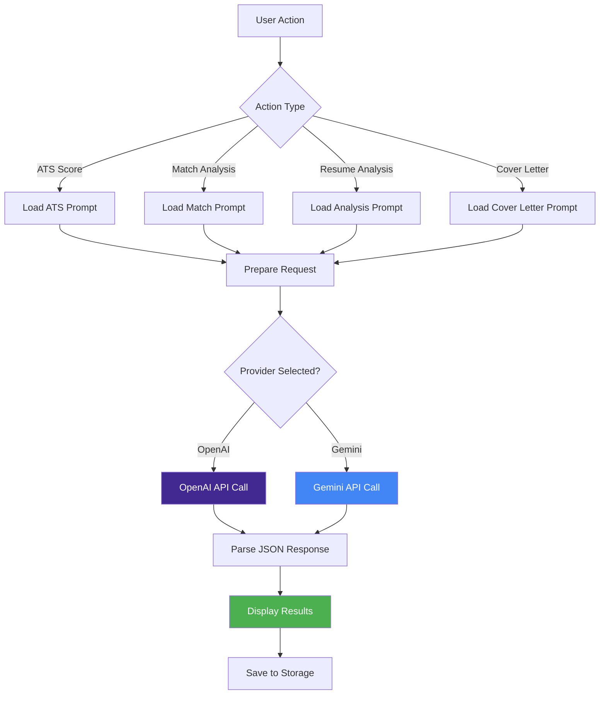

# Resume Analyzer Chrome Extension

[](https://developer.mozilla.org/en-US/docs/Web/JavaScript)
[](https://developer.chrome.com/docs/extensions/)
[](https://openai.com/)
[](https://gemini.google.com/)


A comprehensive Chrome extension for resume analysis, ATS scoring, job matching, and AI-powered cover letter generation using OpenAI GPT and Google Gemini models.

> **Note**: This entire repository is generated using AI-powered coding (AI vibe coding), demonstrating the capabilities of AI-assisted development.

## 📌 Features

- [x] **ATS Resume Scoring** - Get industry-standard ATS score (0-100) with detailed feedback
- [x] **Job Match Analysis** - Calculate match percentage between resume and job posting
- [x] **In-depth Resume Analysis** - Detailed improvement suggestions by section with examples
- [x] **AI Cover Letter Generator** - Generate personalized cover letters (200-250 words, single page)
- [x] **Multi-Provider AI Support** - Choose between OpenAI (GPT-5 Mini, GPT-4o, O1, O3, etc.) or Google Gemini (Gemini 2.5 Flash, Gemini 3 Pro, etc.)
- [x] **Text Selection on Webpages** - Right-click context menu to analyze selected job postings
- [x] **PDF Resume Upload** - Drag & drop or click to upload PDF resumes
- [x] **Dark/Light Theme** - Beautiful themes with preference persistence
- [x] **Local Storage** - All data stored locally, never shared with third parties

## 📁 Project Structure

The directory structure of the project looks like this:

```
resume-analyzer-extension/
├── background.js              # Service worker for extension lifecycle
├── content.js                 # Content script for webpage interaction
├── popup.html                 # Main extension popup UI
├── popup.css                  # Styles with dark/light theme support
├── popup.js                   # Main extension logic and AI integration
├── utils.js                   # Utility functions
├── manifest.json              # Extension manifest (Manifest V3)
├── LICENSE                    # MIT License
├── README.md                  # This file
├── QUICK_START.md            # Quick start guide
├── INSTALL_PDFJS.md          # PDF.js installation guide
├── icons/                     # Extension icons
│   ├── icon16.png
│   ├── icon48.png
│   └── icon128.png
├── lib/                       # Third-party libraries
│   ├── pdf.min.js            # PDF.js for PDF text extraction
│   ├── pdf.worker.min.js     # PDF.js worker
│   ├── pdfjs-setup.js        # PDF.js configuration
│   └── jspdf.umd.min.js      # jsPDF for PDF generation
├── prompts/                   # AI prompt templates
│   ├── ats-score-system.txt
│   ├── resume-analysis.txt
│   ├── section-improvements.txt
│   └── cover-letter-generation.txt
└── template/                  # Cover letter template
    └── cover_letter_template.pdf
```

## 🏗️ Architecture

### System Architecture



### Data Flow Architecture



### Component Interaction Diagram



### AI Processing Flow



## 🚀 Getting Started

### Step 1: Clone the repository

```bash
git clone <repository-url>
cd resume-analyzer-extension
```

### Step 2: Load the extension in Chrome

1. Open Chrome and navigate to `chrome://extensions/`
2. Enable **Developer mode** (toggle in top right)
3. Click **"Load unpacked"**
4. Select the `resume-analyzer-extension` directory
5. The extension should now appear in your extensions list

### Step 3: Configure API Key

1. **Get API Key:**
   - For OpenAI: Sign up at [OpenAI Platform](https://platform.openai.com/) and create an API key
   - For Gemini: Get API key from [Google AI Studio](https://makersuite.google.com/app/apikey)

2. **Set up in Extension:**
   - Click the extension icon in Chrome toolbar
   - Select your AI provider (OpenAI or Gemini)
   - Choose your preferred model from the dropdown
   - Enter your API key
   - Click **"Save"**

### Step 4: Start Using

1. **Upload Resume:**
   - Click extension icon
   - Upload your resume PDF (drag & drop or click to select)

2. **Analyze Job Posting:**
   - Navigate to a job posting page
   - Right-click on selected text → Choose "ATS Score for the selected Job" or "Generate Cover Letter"
   - Or use the "Select Text on Page" button in the extension

3. **View Results:**
   - ATS Score with detailed feedback
   - Match Score analysis
   - In-depth Resume Analysis
   - Generated Cover Letter (downloadable as PDF)

## 📝 Usage Examples

### ATS Resume Scoring

1. Upload your resume PDF
2. Select or paste job description
3. Click "Get ATS Score for This Job"
4. View score, strength label, and collapsible improvement sections

### Job Match Analysis

1. Upload resume
2. Select job posting text (right-click or use extension button)
3. Click "Match Score" analysis
4. See matched/missing skills with detailed examples

### Cover Letter Generation

1. Upload resume
2. Select job posting
3. Click "Generate Cover Letter"
4. Download as PDF (single page, 200-250 words)

## 🔧 Configuration

### Supported AI Models

**OpenAI Models:**
- gpt-5-mini (default)
- gpt-4o, gpt-4o-mini
- gpt-4.1, gpt-4.1-mini, gpt-4.1-nano
- gpt-4.5-preview variants
- o1, o1-preview, o1-mini
- o3, o3-mini
- o4-mini
- gpt-5 variants

**Gemini Models:**
- gemini-2.5-flash (default)
- gemini-3-pro-preview
- gemini-3-flash-preview
- gemini-2.5-flash-lite
- gemini-2.5-pro

### Customization

- **Prompts**: Edit files in `prompts/` directory to customize AI behavior
- **Theme**: Toggle between dark/light theme in extension popup
- **Storage**: All data stored locally in Chrome storage

## 📊 Features in Detail

### ATS Score Section
- Circular progress indicator (0-100)
- Strength label (EXCELLENT/GOOD/AVERAGE/POOR)
- Section-wise analysis with issue counts
- Collapsible improvement points
- Example content for each section

### Match Score Section
- Similar format to ATS Score
- Focuses on job-resume matching
- Detailed mismatch analysis
- Improvement suggestions with examples

### In-depth Resume Analysis
- Comprehensive section-by-section analysis
- Improvement points with details
- Example content for improvements
- Collapsible sections for easy navigation

## 🛠️ Technical Details

### Technologies Used

- **JavaScript (ES6+)** - Core logic
- **Chrome Extension APIs** - Manifest V3
- **PDF.js** - PDF text extraction
- **jsPDF** - PDF generation
- **OpenAI API** - GPT models
- **Google Gemini API** - Gemini models
- **Chrome Storage API** - Local data persistence

### Browser Compatibility

- Chrome (latest version recommended)
- Edge (Chromium-based)
- Other Chromium-based browsers

## 📋 Requirements

- Chrome browser (latest version recommended)
- AI API key (OpenAI or Google Gemini)
- Internet connection (for API calls)
- PDF resume files (with selectable text for best results)

## 🔒 Privacy & Security

- **Local Storage**: All data stored locally in Chrome storage
- **No Third-Party Sharing**: Data only sent to selected AI provider (OpenAI/Gemini)
- **API Key Security**: API keys stored locally, never shared
- **No Tracking**: Extension does not track user behavior

## 🐛 Troubleshooting

### Common Issues

**PDF not extracting text:**
- Ensure PDF has selectable text (not just images)
- Try copying resume text manually using "Paste Resume Text" option

**API errors:**
- Verify API key is correct and has sufficient credits
- Check internet connection
- Ensure selected model is available in your API plan

**Job posting not detected:**
- Use "Select Text on Page" button or right-click context menu
- Ensure you're on a regular webpage (not chrome:// pages)

**Theme not saving:**
- Clear extension storage and try again
- Check Chrome storage permissions

## 🚧 Future Enhancements

- [ ] Support for multiple resume formats (DOCX, TXT)
- [ ] Batch job analysis
- [ ] Export analysis reports
- [ ] Resume template library
- [ ] History of analyzed jobs and cover letters
- [ ] Multi-language support
- [ ] Integration with job boards

## 📄 License

This project is licensed under the MIT License - see the [LICENSE](LICENSE) file for details.

## 📞 Support

For issues or questions:
1. Check your API key is valid and has credits
2. Ensure you have internet connection
3. Verify the extension has necessary permissions
4. Make sure Chrome is up to date

## 🙏 Acknowledgments

- OpenAI for GPT models
- Google for Gemini models
- PDF.js contributors
- jsPDF contributors
